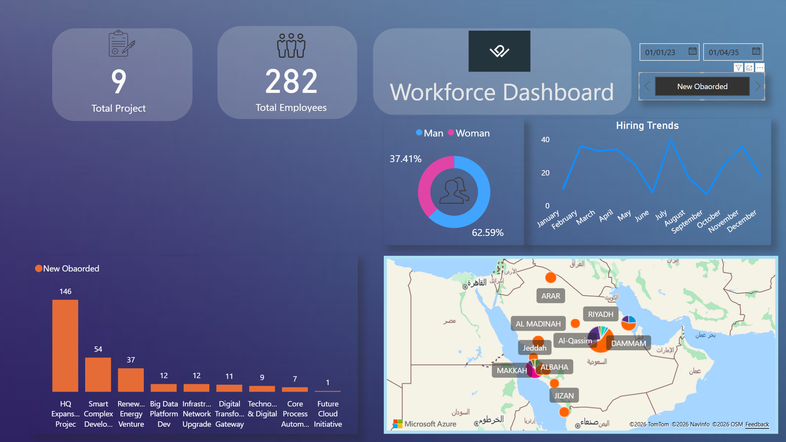

# Professional Talent Insights: Modern Glassmorphism Dashboard 📊

 

## 📝 Project Overview
This project features a high-end **Power BI Dashboard** designed to monitor and analyze professional staffing across various strategic projects. Using a sleek **Glassmorphism design**, the dashboard provides a modern visual experience to track team allocations, hiring trends, and project-based distribution without compromising data clarity.

## ✨ Key Features
* **Strategic Project Tracking:** Visualization of staff distribution across 16 major projects, including Digital Transformation, Renewable Energy, and Corporate Excellence.
* **Growth Analytics:** A smooth-line trend analysis showing monthly hiring momentum with professional data smoothing.
* **Status Intelligence:** Interactive filtering by professional status (Active, Terminated, Annual Leave, etc.) using customized glass-style buttons.
* **Geographic Distribution:** Interactive mapping of professional presence across the Kingdom of Saudi Arabia.
* **Modern UI/UX:** A fully transparent "Glass" interface optimized for dark-blue backgrounds for a premium look.

## 🛠️ Tech Stack
* **Microsoft Power BI:** Data visualization and dashboard architecture.
* **Power Query:** Advanced data cleaning and date-type transformations.
* **DAX (Data Analysis Expressions):** Custom measures for dynamic counting and percentages.
* **UI Design:** Implementation of Glassmorphism principles (Blur, Transparency, and Rounded Corners).

## 🚀 How to Use
1.  Download the `.pbix` file.
2.  Open it using **Power BI Desktop**.
3.  Use the **Top Filter Bar** to switch between months and the **Side Buttons** to filter by professional status.

**Designed with a focus on modern aesthetics and data-driven professional decision making.**
